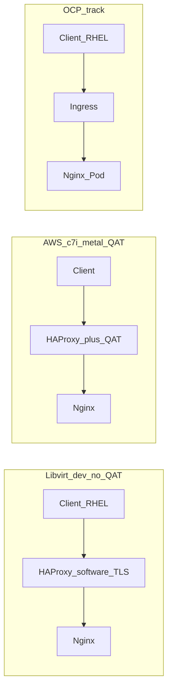

# Intel QAT + HAProxy performance test plan (project qat)

## Decision: template fidelity (your choice **C**)

- **Phase 1 (default path):** Maintain **scenario-equivalent** `haproxy.cfg` snippets per test (a–e) with the same TLS **topology** as OpenShift Router (plain HTTP, edge TLS→HTTP backend, re-encrypt TLS→TLS backend). Document a **mapping table** from each scenario to relevant `ROUTER_*` / `SSL_*` / cipher env semantics from the upstream [haproxy-config.template](https://github.com/openshift/router/blob/master/images/router/haproxy/conf/haproxy-config.template) (many directives are env-driven at render time; see `global` / `defaults` / `frontend` blocks in that file).
- **Phase 2 (validation):** Optionally capture **byte-level parity** by either (1) extracting `/var/lib/haproxy/conf/haproxy.config` (and map files) from a running `openshift-ingress` router pod for a **Route/Ingress** that mirrors each scenario, or (2) a **small Go harness** that imports the openshift/router template package with fixture `State`/`ServiceUnits`—only if you need provable identity with the shipped template.

The upstream template is **Go `text/template`** plus router-internal data (`.State`, `.ServiceUnits`, generated maps), not plain envsubst—so Phase 1 is the practical load-test path; Phase 2 is for alignment audits.

---

## Architecture (conceptual)

---

## 1. Backend: “as fast as possible” (simple to operate)

**Recommendation:** **nginx** on RHEL (AppStream or official repo), serving a **minimal static response** (e.g. 200 with empty/small body or `return 200` in a tiny `location`). Tune for throughput, not realism:

- `worker_processes auto`, high `worker_connections`, `keepalive_requests` high, `sendfile on`, `tcp_nopush`/`tcp_nodelay` as appropriate.
- **Avoid** heavy logging or disk access during the timed run.

Document **pinning** nginx and kernel tunables (`somaxconn`, `ulimit`) identically across libvirt and AWS so numbers are comparable.

---

## Deployment stages: libvirt → AWS non-QAT → AWS QAT (metal)

**Libvirt (local laptop):** Run **Terraform + Ansible** and **all scenarios (a–e)** with **software TLS** only—**no QAT**. Goals: validate deployment, **client → HAProxy → nginx** connectivity, certs, termination modes, and **smoke / light wrk** before AWS.

**Guest sizing (align with `c7i.large`):** **2 vCPU**, **4 GB RAM**, **10 GB disk** **per VM** (client and server guests). **RHEL 9.6** base image: **`/var/lib/libvirt/images/rhel-9.6-x86_64-kvm.qcow2`** — Terraform libvirt should **clone** (or use backing volume) from this qcow2 so each guest gets its own writable disk; avoid destructive changes to the golden file. Expose the path as a **Terraform variable** with that default for portability.

**Host note:** 10 GB per guest is **minimal**—keep package sets lean (HAProxy, nginx, certs, wrk); document **disk pressure** if DNF or logs fill the volume.

**AWS phase 1 — parity smoke (non-QAT):** Deploy **client** and **server** (HAProxy + nginx) as **`c7i.large`** each. Repeat the **same** non-QAT connectivity and smoke tests as libvirt to confirm cloud networking, AMIs, Ansible, and secrets behave. **No QAT packages required** beyond what is harmless to install disabled.

**AWS phase 2 — performance + QAT:** After phase 1 is signed off, **resize or replace** the server (and optionally client if needed for load) with **`c7i.metal-24xl`**, apply **[Intel QAT in VM / bare metal](https://intel.github.io/quickassist/qatlib/running_in_vm.html)** guest requirements (kernel cmdline, VFIO, `qat`, `POLICY`, etc.), run **QAT validation** smokes, then execute scenarios **(c)** and **(e)** with **QAT-accelerated** crypto and full benchmark tuning. Scenarios **(a)(b)(d)** remain useful baselines on metal (software paths where applicable).

---

## Stage gates: tests before advancing

Do **not** move to the next stage until the current stage’s checklist is **pass**. Record results in a short **gate log** (date, stage, pass/fail, command outputs or paths to logs).

### During provisioning (each environment)

Applies whenever Terraform/Ansible runs (libvirt or AWS).

| # | Test | Pass criteria |
|---|------|----------------|
| T1 | Terraform exit state | `terraform apply` completes with no error; outputs include client + server addresses. |
| T2 | SSH | From provisioner: SSH to **client** and **server** with expected user (**cloud-user** libvirt, **ec2-user** AWS) using the key from **`ssh_key_file`** / Terraform `ssh_key_file`; no host key surprises after first connect. |
| T3 | Ansible | Playbook completes; optional **second run** reports **no unexpected changes** (idempotency). |
| T4 | Disk space | On each guest: sufficient free space for packages and logs (e.g. `df -h /`); **≥ ~1 GiB** free on 10 GiB libvirt roots before load tests. |
| T5 | Time (optional) | `chronyd`/`ntpd` active if you compare latencies across hosts (nice-to-have for smoke). |

### Gate L — Libvirt (laptop) complete → allowed: AWS `c7i.large`

**Goal:** Topology and automation are correct **without QAT**; all five scenarios behave at **smoke** level.

| # | Test | Pass criteria |
|---|------|----------------|
| L1 | nginx | On server: `systemctl is-active nginx` (or equivalent); **HTTP 200** from **localhost** to the benchmark URL (e.g. `curl -sfS http://127.0.0.1:.../`). |
| L2 | HAProxy | `systemctl is-active haproxy`; `haproxy -c -f /path/to/haproxy.cfg` exits **0** after each scenario switch. |
| L3 | Scenarios (a–e) | From **client VM**, for each active HAProxy profile: **(a)** HTTP→HTTP returns 200; **(b)** HTTPS→HTTP returns 200 (verify cert if using `-k` or trust store); **(c)** same as (b), software TLS; **(d)(e)** HTTPS with re-encrypt returns 200 and **no** proxy TLS errors in HAProxy logs. |
| L4 | TLS sanity | For (b)(c)(d)(e): `openssl s_client -connect <server>:<port> -servername <SNI> </dev/null` completes handshake (where applicable). |
| L5 | Load smoke | **wrk** (or wrapper) short run (e.g. a few seconds): non-zero RPS, **no** client crash; HAProxy stats or access log shows requests. |
| L6 | Firewall | Client → server reachability only on **allowed** ports (80/443 as designed); unintended ports closed. |

**Proceed to AWS phase 1** only when **L1–L6** pass.

### Gate A — AWS `c7i.large` complete → allowed: resize to `c7i.metal-24xl`

**Goal:** Same behavior as libvirt in the cloud (networking, AMIs, Ansible, **`ssh_key_file`**, SGs).

| # | Test | Pass criteria |
|---|------|----------------|
| A1 | Reachability | Client **private IP** reaches server **listener** ports; **security groups** and **NACLs** documented and match intent. |
| A2 | Repeat L1–L6 | Same logical tests as Gate L from the **EC2 client** to **EC2 server** (paths/certs updated if hostnames changed). |
| A3 | Inventory | Ansible inventory reflects **ec2-user**, correct IPs/DNS; no manual ssh config hacks required for automation. |

**Proceed to metal + QAT** only when **A1–A3** pass.

### Gate M — AWS `c7i.metal-24xl` + QAT → allowed: full benchmark matrix (accelerated scenarios)

**Goal:** Hardware QAT usable by the stack; then tune for performance (not just smoke).

| # | Test | Pass criteria |
|---|------|----------------|
| M1 | QAT devices | `lspci` shows QAT devices; drivers/`qatmgr` per Intel smoke section; **QAT validation** commands pass (engine/sample as chosen). |
| M2 | HAProxy + QAT | HAProxy starts with **QAT-enabled** TLS config for (c)(e); `haproxy -vv` shows expected OpenSSL/engine linkage; **no** crash on reload. |
| M3 | Scenarios (c)(e) accelerated | Functional test: client requests succeed under (c) and (e) with QAT path enabled; compare **optional** `openssl speed` or service counters only if documented—**primary** is successful e2e HTTP. |
| M4 | Baseline optional | (a)(b)(d) still pass on metal for regression. |

**Proceed to full CPS/latency benchmark campaigns** only when **M1–M4** pass.

### Gate O — OpenShift track (optional)

Only if you run Part 2.

| # | Test | Pass criteria |
|---|------|----------------|
| O1 | Cluster / ingress | `kubectl`/`oc` access OK; **Ingress** or **Route** has **ADDRESS**; DNS or `/etc/hosts` from client VM resolves to VIP. |
| O2 | Workload | nginx **Deployment** **Ready**; **Service** endpoints match pods. |
| O3 | E2E | From client: `curl -sfS` to Ingress URL (HTTP/HTTPS per scenario); for TLS, SNI matches cert. |
| O4 | Smoke load | Short **wrk** against Ingress URL: non-zero RPS, acceptable errors **0** for smoke duration. |

---

## QAT in a VM: Intel requirements (AWS `c7i.metal-24xl` and similar)

Use **[Running in a Virtual Machine (VM)](https://intel.github.io/quickassist/qatlib/running_in_vm.html)** as the **normative** checklist when the **guest has QAT hardware** (here: **metal** after phase 2). This block does **not** apply to the default **libvirt** or **`c7i.large`** paths.

**Where it applies:** Bare metal or hosts that expose QAT to the OS; for **EC2 metal**, follow Intel + AWS guidance for device visibility. **VF passthrough** wording in the doc targets KVM; on native metal, bind drivers per QATlib install docs.

**Guest OS (RHEL) highlights from the guide:** `intel_iommu=on`, `aw-bits=48` when IOMMU is in play; `vfio_pci` where used; `qat_4xxx` as needed; **`/etc/sysconfig/qat`** and **`POLICY`** / **`qatmgr`**; troubleshooting **memlock**, **`dma_entry`** (`vfio-iommu-type1`), **IOMMU faults**.

**Libvirt with QAT (optional, out of default scope):** Only if a future lab has a QAT-capable host and you intentionally pass VFs—then use **q35**, **ioapic qemu**, **Intel IOMMU**, and VF **hostdev** layout from the same Intel page. **Not required** for the standard libvirt validation track.

---

## QAT validation (smoke tests before HAProxy load on metal)

Intel’s flow often shows **Docker**-wrapped checks; **the same checks apply on a plain RHEL host** (see user note). Run this **only after AWS phase 2 (metal)** or any QAT-capable guest—not on libvirt/`c7i.large`.

- **Post-boot checklist:** `lspci` for QAT devices, `lsmod` / driver binding, **`qatctl` / `adf_ctl`** per distro, **`cpa_sample_code`** or OpenSSL engine probes per [QATlib / engine docs](https://intel.github.io/quickassist/).
- **Optional Docker parity:** Container image mirroring Intel’s tests only if CI needs it; **default = standalone** commands in Ansible.

Record pass/fail in the runbook **before** scenarios **(c)** and **(e)** with QAT enabled.

---

## 2. HAProxy + OpenShift template alignment

**Phase 1 configs (per scenario):**

| Scenario | Client → HAProxy | HAProxy → backend | QAT focus                                        |
| -------- | ---------------- | ----------------- | ------------------------------------------------ |
| (a)      | HTTP             | HTTP              | None / baseline                                  |
| (b)      | TLS (client)     | HTTP              | TLS offload at HAProxy (software)                |
| (c)      | TLS              | HTTP              | **QAT** at HAProxy edge on **metal**; **software** TLS on libvirt / `c7i.large` |
| (d)      | TLS              | TLS (re-encrypt)  | Software TLS both sides (same on all stages)                                    |
| (e)      | TLS              | TLS               | **QAT** front + re-encrypt on **metal**; **software** on libvirt / `c7i.large`   |

- Implement **TLS termination** and **re-encrypt** using `bind ... ssl` and `server ... ssl verify` with the same cert layout you would use for Ingress (server cert + CA for backend verification).
- **QAT (only AWS `c7i.metal-24xl` after validation):** `qatlib`, Intel QAT OpenSSL engine (or OpenSSL 3 provider per distro), HAProxy build that can use the engine; `ssl-engine` (or equivalent) in `global` per `haproxy -vv`. **Libvirt and `c7i.large`:** install/configure HAProxy with **software OpenSSL** only; scenarios (c)(e) still run to validate **topology**, not acceleration.

**Scripting:** A shell script (or Ansible role task) that:

1. Exports **documented** `ROUTER_`* / `SSL_`* env vars you want to mirror (e.g. `ROUTER_THREADS`, `ROUTER_MAX_CONNECTIONS`, `SSL_MIN_VERSION`, `ROUTER_CIPHERS`—see template `global` section in the [upstream template](https://raw.githubusercontent.com/openshift/router/master/images/router/haproxy/conf/haproxy-config.template)).
2. **Selects** the right `haproxy.cfg` fragment for scenario (a–e) and merges with certs paths.
3. Reloads HAProxy (`systemctl reload haproxy` or `socket` reload).

**Phase 2:** Document the exact `oc` steps to create **Route**/`Ingress` with `edge` vs `reencrypt` and a **Service** for nginx; then `kubectl exec` into `router-`* pod and copy rendered config for diff against Phase 1.

---

## 3. Load generator: minimal memory, thousands of CPS, latency + throughput

**Goals (priority order):**

1. **Low client memory footprint** — avoid heavy runtimes on the load VM so the client is not the bottleneck and results stay repeatable.
2. **High connection rate (CPS)** — stress HAProxy with **many new TLS/TCP connections per second** (this is often the limiting factor for edge TLS and for HAProxy `maxconn` / handshake cost). Target **scaling into at least the low thousands of new connections per second** with headroom; tune upward until HAProxy or network saturates.
3. **Metrics:** aggregate **TPS/RPS** and **latency** (p50/p95/p99 or histogram) for the whole run, and **ideally per-second** samples for the same.

**CPS vs RPS:** Document two explicit modes in the runbook:

- **CPS stress mode:** force **one request per connection** (e.g. `Connection: close` or wrk Lua that closes after each request) so **new connection + optional TLS handshake** dominates — matches “stress the HAProxy” for TLS scenarios (b–e).
- **Keep-alive RPS mode (optional):** same tool with keep-alive to measure steady-state throughput once CPS headroom is understood.

**Tool choice:**

| Tool       | Memory                                  | CPS / scale                                                                                                    | Per-second metrics                                                                                                             |
| ---------- | --------------------------------------- | -------------------------------------------------------------------------------------------------------------- | ------------------------------------------------------------------------------------------------------------------------------ |
| **wrk**    | Very low (small C binary)               | Excellent at high concurrency; use `**-c`** threads/connections and **rate** discipline to approach target CPS | Lua `setup`/`report`/`done` hooks to emit **CSV per second** (lightweight counters); or wrap wrk and parse stdout periodically |
| **wrk2**   | Very low                                | Same as wrk; **coordinated omission** latency correction                                                       | Same Lua pattern                                                                                                               |
| **vegeta** | Low–moderate (single Go binary, no JVM) | Good rate control (`-rate`) for sustained CPS; tune workers                                                    | `vegeta report -reporter=json` with **interval** buckets                                                                       |
| **k6**     | **Higher** (V8 per process)             | Strong reporting                                                                                               | **Demote to optional** only if you need richer scripting and accept extra RAM                                                  |

**Recommendation:** **Primary: wrk or wrk2** — smallest memory footprint, industry-standard for max load, and suitable for **1k+ CPS** when combined with enough client threads, open files, and ephemeral ports. Build from source or use distro packages on RHEL client VM. **Secondary:** vegeta if you prefer JSON interval reports without Lua. **Avoid** defaulting to k6 on the same small client VM.

**Client OS tuning (document in runbook):** `ulimit -n`, `net.ipv4.ip_local_port_range`, possibly **multiple wrk processes** with **SO_REUSEPORT**-style fan-out (multiple binds to same target) or multiple client IPs if you hit **ephemeral port exhaustion** before thousands of CPS.

**Deliverables:**

- One **wrapper script** (shell + optional Lua) that runs a fixed duration, prints **aggregate** requests/sec and **connection-appropriate** latency stats, and writes **per-second CSV** (or minimal JSON lines) from wrk Lua or a tiny sidecar sampler.
- `vars.yml` (or Ansible vars) for **threads**, **connections**, **duration**, **CPS vs keep-alive flag**, and **client sysctl/ulimit** so runs are reproducible.

---

## 4. Part 1: Terraform + Ansible (libvirt + AWS)

**Layout per [project rules](file:///home/rgordill/PoC/aws/qat/.cursor/rules/terraform.mdc):** root [`terraform/`](file:///home/rgordill/PoC/aws/qat/.cursor/rules/terraform.mdc) with `providers.tf`, `variables.tf`, `outputs.tf`; use **workspace** or **separate directories** `terraform/libvirt` and `terraform/aws` as needed (single root `terraform/` convention—prefer **submodules** or **`-chdir`** with README).

**Libvirt module (no QAT):**

- **Purpose:** End-to-end validation on **your laptop** (Terraform + Ansible), **all scenarios (a–e)** with **software TLS only**, connectivity and smoke tests—**before AWS**.
- **Topology:** e.g. **two guests** (client + server with HAProxy + nginx), or split backends if you prefer. **No** QAT VF passthrough.
- **Resources per guest:** **2 vCPU**, **4096 MiB RAM**, **10 GiB** system disk — matches **AWS `c7i.large`** vCPU/RAM for comparable behavior; EBS root size on AWS may differ but workload stays the same class.
- **OS image:** Base **`/var/lib/libvirt/images/rhel-9.6-x86_64-kvm.qcow2`** (variableized default); clone per domain in libvirt/Terraform.
- Provider: `dmacvicar/libvirt`; cloud-init installs **`ssh_key_file`** contents for **`libvirt_ssh_user`** (default **cloud-user**; [vm.mdc](file:///home/rgordill/PoC/aws/qat/.cursor/rules/vm.mdc)).

**AWS module (staged instance types):**

- **Smoke / parity:** Variables (or workspace) for **`c7i.large`** **client** and **`c7i.large`** **server**—mirror libvirt behavior (non-QAT), confirm SSH, SGs, routing, Ansible, certs.
- **Performance + QAT:** Bump server (and client if needed) to **`c7i.metal-24xl`**, then apply **QAT** `qat_prereqs`, Intel guest steps, and accelerated scenarios (c)(e).

**Ansible:** Roles only; playbooks orchestrate:

- `cloud.terraform.terraform` + `terraform_output` (no Jinja-generated `.tf` files).
- **Shared roles:** `nginx_benchmark`, `haproxy` (or `haproxy_qat` with **`enable_qat: false`** on libvirt/large), `certs`, `loadtest_client` (wrk/wrk2; optional k6).
- **Conditional:** `qat_prereqs` (kernel cmdline when needed, VFIO/QAT drivers, **`/etc/sysconfig/qat`**, **standalone QAT smokes** per Intel/Docker-equivalent commands)—**only when** `inventory` or `host_vars` mark the host as **QAT-enabled** (metal phase).
- Secrets: SSH **public** key from **`ssh_key_file`** (see [vm.mdc](file:///home/rgordill/PoC/aws/qat/.cursor/rules/vm.mdc)); other sensitive values via Vault per [ansible.mdc](file:///home/rgordill/PoC/aws/qat/.cursor/rules/ansible.mdc).

**Pinned collections and lint (implemented in-repo):**

- **`ansible/requirements.yml`** pins **`cloud.terraform`** and **`community.crypto`** to exact versions (currently **4.0.0** and **2.26.7**; bump deliberately when upgrading). Galaxy’s `version:` strings must **not** contain a space after `>=` (e.g. use `">=2.0.0"` not `">= 2.0.0"`) or install fails with `LooseVersion` errors.
- **Install:** `ansible-galaxy collection install -r ansible/requirements.yml -p ansible/collections` (project-local path; **`ansible/collections/`** is gitignored—reinstall from requirements on clone).
- **`ansible/ansible.cfg`** sets **`collections_path = collections`** so playbooks resolve the project-local tree (singular key per Ansible 2.19+).
- **Lint:** from **`ansible/`**, run **`ansible-lint playbooks roles`**. Config: **`ansible/.ansible-lint`** uses **`profile: production`** and skips **`var-naming[no-role-prefix]`** where roles intentionally share cross-role variable names from `group_vars`. **`community.crypto.x509_certificate`** tasks carry **`# noqa: args[module]`** where the linter’s schema lags the collection (false positive on `subject` for selfsigned CA).
- **Gate T3 / CI:** treat **`ansible-galaxy collection install …`** + **`ansible-lint playbooks roles`** (exit **0**) as part of “Ansible OK” before promoting stages.

**Shell scripts (`scripts/` layout):**

- **`scripts/utils/`** — shared helpers: **`gates.sh`**, **`wrk-cps-smoke.sh`**, **`render-haproxy-env.sh`**, **`wrk-latency-report.lua`** (not scenario-specific).
- **`scripts/vm/`** — **`deploy-scenario.sh <a|b|c|d|e>`** runs **`ansible-playbook … deploy_benchmark.yml -e haproxy_scenario=…`** (optional **`--ask-vault-pass`** only if other vault secrets are used); **`run-scenario-tests.sh`** curls **`http://SERVER:80/`** for **(a)** and **`https://SERVER:443/`** (`-k`) for **(b–e)**, optional **`openssl s_client`** for TLS, **`wrk`** only for **(a)** (stock **wrk** has no `-k`); **`deploy-and-test-all.sh`** loops **a–e** with **`SERVER=<haproxy-ip>`** env.
- **`scripts/openshift/`** — **`deploy-scenario.sh`** applies **`kubernetes/`** namespace + nginx + service, deletes prior Ingress objects, then applies **HTTP Ingress** for **(a)**, **edge** for **(b)(c)**, **reencrypt** for **(d)(e)**; substitute host via **`INGRESS_HOST`** (replaces `qat-bench.apps.example.com`). **`(c)(e)`** vs **`(b)(d)`** use the same YAML—**QAT at the router** is cluster configuration, not these manifests. **`run-scenario-tests.sh`** / **`deploy-and-test-all.sh`** curl **`http(s)://INGRESS_HOST/`** accordingly.
- **`kubernetes/ingress-http-example.yaml`** — plain HTTP Ingress for scenario **(a)** (paired with edge/reencrypt examples).

---

## 5. Part 2: Client VM + OpenShift on same network

- **Same five scenarios** at the **logical** level: **Ingress** (or **Route**) with `edge` vs `reencrypt`, nginx **Deployment** + **Service**, backend TLS for (d)(e) via **cert** on nginx or **Ingress** backend CA. Use **`scripts/openshift/deploy-scenario.sh`** / **`run-scenario-tests.sh`** for repeatable deploy + smoke (set **`INGRESS_HOST`**).
- **IngressController** (OCP) already uses the same HAProxy template family; **QAT on the router** is non-trivial: you may need **unsupportedConfigOverrides** / custom **IngressController** env to inject OpenSSL engine settings, or a **Node** with QAT + device plugin. Reuse your existing Intel accelerator hints from sibling assets (e.g. IOMMU / NodeFeatureRule for `intel.qat` under `intel-accelerators` in your PoC tree) and align with **OCP version** docs.
- Client: same **wrk**/wrapper scripts under **`scripts/utils/`** targeting **Ingress VIP** / **Route host** (DNS or `/etc/hosts`).

---

## 6. Deliverables checklist

- **Ansible:** pinned **`requirements.yml`**, **`ansible.cfg`** `collections_path`, **`ansible-galaxy collection install`**, **`ansible-lint playbooks roles`** + **`.ansible-lint`** (see **Pinned collections and lint** above).
- Terraform: **libvirt** (no QAT): **2 vCPU / 4 GB / 10 GB** per VM, **`rhel-9.6-x86_64-kvm.qcow2`** base path variable + **AWS** (`c7i.large` vs `c7i.metal-24xl`); outputs for Ansible; AWS SGs / networking for client↔server.
- **Stage gate checklists** (L / A / M / O): documented tests in **Stage gates** section; **gate log** before each promotion (libvirt → AWS large → metal → optional OCP).
- Ansible roles + site playbook; optional Vault for non-SSH secrets; **`ssh_key_file`** for Terraform; **conditional** QAT role.
- Phase 1: scenario **(a–e)** HAProxy configs + env mapping doc + reload script.
- Phase 2: optional router config extraction / diff procedure.
- Load-test scripts: **CPS-oriented** workload, aggregate + per-second metrics, pinned client sysctl/ulimit and workload parameters; **`scripts/utils/`** + **`scripts/vm/`** / **`scripts/openshift/`** scenario automation (see **Shell scripts** under Part 1).
- Short **runbook**: one page per scenario (commands, expected topology, where to read metrics); **stage** column (libvirt / AWS large / AWS metal); **copy-paste gate checks** from **Stage gates** for each promotion.

---

## Risks / notes

- **Ordering:** Skipping **laptop libvirt** or **AWS `c7i.large`** smoke risks burning time on **metal** debugging Ansible/networking instead of QAT.
- **10 GB libvirt disk:** Tight for two full RHEL guests on the laptop—minimize installed packages and log rotation; expand disk in Terraform if smoke runs fail for space.
- **`c7i.metal-24xl`:** Confirm **QAT device visibility** and **RHEL/AWS** driver stack; apply [Intel QAT VM/metal](https://intel.github.io/quickassist/qatlib/running_in_vm.html) guest steps as applicable; watch **memlock** and **IOMMU `dma_entry`** when using VFIO.
- **OCP + QAT:** May require cluster-level changes; treat as a **stretch** in the same test matrix if router customization is blocked by support policy.
- **Apples-to-apples:** Keep cipher suite and TLS version aligned between VM HAProxy and OCP Ingress for comparable scenarios.
- **CPS ceiling on one client:** Thousands of **new** connections per second can exhaust **ephemeral ports** or file descriptors before HAProxy saturates—document when to add **extra client IPs**, **wrk processes**, or a second load VM.

